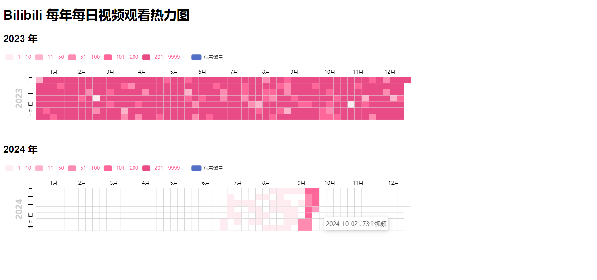

# 获取哔哩哔哩历史记录并生成热力图

该项目旨在处理、分析和可视化哔哩哔哩用户的历史数据。这些工具包括数据清洗、数据库导入、历史分析以及通过邮件通知进行自动化日志记录。以下部分详细解释了每个模块的用途和使用方法。

最终效果如下：


## 项目起因
由于想找以前的一个历史视频时发现只有前面10几天记录的视频数量是准确的，往前推半个月发现每天记录的视频只有4，5个甚至只有1个，于是有了此项目

## 风险
API设置了每隔1秒请求一次，目前我已经自动化运行几天了，由于是每天晚上0点请求且一天只运行1次，所以还没有任何风险，还是不放心的可以调整下面内容来自定义暂停频率和个性化请求：
```python
# 暂停1秒在请求
time.sleep(1)

headers = {
    'Cookie': "SESSDATA=" + cookie,
    'User-Agent': 'Mozilla/5.0 (Windows NT 10.0; Win64; x64) AppleWebKit/537.36 (KHTML, like Gecko) Chrome/85.0.4183.121 Safari/537.36',
    'Referer': 'https://www.bilibili.com',
}

# 初始化参数
params = {
    'ps': 30,  # 每页数量，默认为 20，最大 30
    'max': '',  # 初始为空
    'view_at': '',  # 初始为空
    'business': '',  # 可选参数，默认为空表示获取所有类型
}
```

## 主要功能
使用的API来自[bilibili-API-collect](https://github.com/SocialSisterYi/bilibili-API-collect)
由于Web 端的 Cookie 会随着一些敏感接口的访问逐渐 ***失效*** ，所以需要把 localStorage 的 `ac_time_value` 字段删除才不会刷新，具体见[Web端Cookie刷新](https://socialsisteryi.github.io/bilibili-API-collect/docs/login/cookie_refresh.html)
1. **数据获取**：获取用户的观看历史数据。
2. **数据清洗**：清理和格式化原始数据，现在清理后的数据保存在 `output/cleaned_history_by_date` 目录下。
3. **数据库导入**：支持将数据导入到 MySQL 或 SQLite 数据库。
4. **数据分析**：分析用户的观看习惯，包括每日和每月的观看统计。
5. **数据导出**：将分析结果导出为 Excel 文件。
6. **热力图生成**：生成每年每日视频观看热力图。
7. **API 接口**：提供 RESTful API 以访问各种功能。

## 配置

项目使用 `config/config.yaml` 文件进行配置。主要配置项包括：

- `cookie`：Bilibili 用户的 cookie，用于 API 认证。
- `input_folder`：原始历史记录数据的输入文件夹。
- `output_folder`：清理后的历史记录数据的输出文件夹。
- `db_file`：SQLite 数据库文件名。
- `log_file`：导入日志文件名，用于记录上次导入的位置。
- `categories_file`：分类配置文件名。
- `fields_to_remove`：清理数据时需要移除的字段列表。

## 使用方法

1. 克隆仓库并安装依赖：
   ```
   git clone <repository-url>
   cd <repository-name>
   pip install -r requirements.txt
   ```

2. 配置 `config/config.yaml` 文件，确保填入正确的 Bilibili cookie。

3. 运行主程序：
   ```
   python main.py
   ```

4. 访问 API 接口（默认地址为 `http://127.0.0.1:8000`）：
   - `/fetch/fetch_history`：获取历史记录
   - `/clean/clean_data`：清理数据
   - `/importMysql/import_data_mysql`：导入数据到 MySQL
   - `/importSqlite/import_data_sqlite`：导入数据到 SQLite
   - `/analysis/daily_counts`：获取每日观看计数
   - `/analysis/monthly_counts`：获取每月观看计数
   - `/export/export_history`：导出数据到 Excel
   - `/heatmap/generate_heatmap`：生成观看历史热力图
   - `/log/send_log`：发送最新的日志邮件

## 注意事项

- 确保在使用前正确配置 `config.yaml` 文件。
- 首次运行时，程序会获取所有可用的历史记录。后续运行只会同步新的记录。
- API 请求频率限制为每秒一次，以避免对 Bilibili 服务器造成过大压力。
- 清理后的数据现在保存在 `output/cleaned_history_by_date` 目录下，保持原有的年/月/日目录结构。

## 贡献

欢迎提交 issues 和 pull requests 来改进这个项目。
